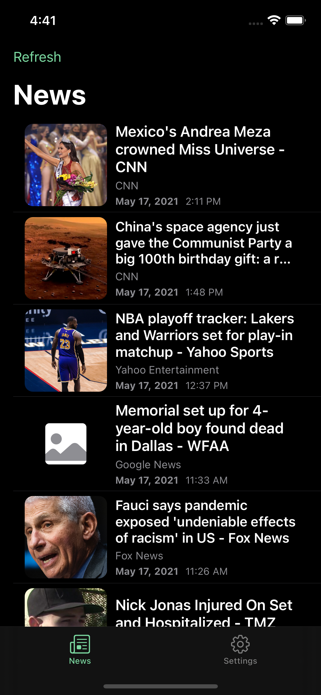
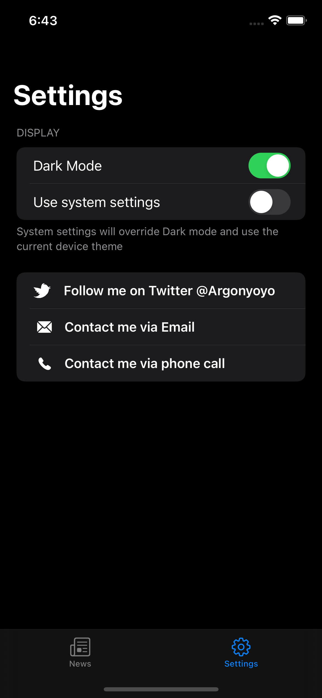

# DZ News App

SwiftUI, A news app, follow the courses by [tundsdev](https://twitter.com/tundsdev).

# Menu
* [Screenshots](#screenshots)
* [Features](#features)
* [To-Do](#to-do)
* [Source](#source)
* [Contributions](#contributions)
* [Contact](#contact)

# Screenshots

  

  

* Custom alert View &nbsp;

* Redacted View

# Features

* Custom alert view
* UIKit in SwiftUI(SFSafariView)
* Placeholder view
* Redacted view when loading
* Adaptive Dark Mode with UserDefaults

### To-Do
* Pull to refresh in SwiftUI

# Source
The courses: [tundsdev](https://twitter.com/tundsdev), fully developed with Swift.

### Library

[URL Image](https://github.com/dmytro-anokhin/url-image)

### API

[Lil-API](https://api.lil.software/news)

# Contributions

* All kinds of contributions (enhancements, new features, documentation & code improvements, issues & bugs reporting & todo task) are welcome. Let's make it better.

# Contact
Created by [Terry Kuo](https://twitter.com/ArgonYoYo) - feel free to contact me!
